# ChessGame

Table of Contents

- [What This Project Shows](#what-this-project-shows)
- [Current Scope](#current-scope)
- [Project Structure](#project-structure)
- [Design Overview](#design-overview)
- [Class Relationships](#class-relationships)
- [Package Responsibilities](#package-responsibilities)
- [Movement Validation Design](#movement-validation-design)
- [Strategy Pattern](#strategy-pattern)
- [Chain of Responsibility](#chain-of-responsibility)
- [Piece Creation](#piece-creation)
- [Game State Checking](#game-state-checking)
- [Game Flow](#game-flow)
- [Special Moves](#special-moves)
- [Custom Exceptions](#custom-exceptions)
- [Manual Tests](#manual-tests)
- [Current Limitations and Future Improvements](#current-limitations-and-future-improvements)


ChessGame is a Java console chess engine built to demonstrate object-oriented design through a rule-heavy domain. The project focuses on separating board state, piece behavior, movement validation, game-state checking, and special move execution instead of placing all chess logic inside one large class.

The core design uses reusable MoveStrategy objects for piece movement and a Chain of Responsibility validation flow for move rules. This keeps the code easier to read, extend, and test while still supporting real chess behavior such as check, checkmate, stalemate, promotion, castling, resigning, and invalid move handling.

## What This Project Shows

This project shows how a chess engine can be organized around clear responsibilities. User input, move validation, board updates, king-safety checks, and special moves are handled by separate classes, while pieces reuse shared movement strategies instead of duplicating rule logic.

The main technical ideas shown in this project are inheritance, composition, polymorphism, Strategy Pattern, Chain of Responsibility, a simple factory-style piece creator, custom exceptions, and temporary board simulation for checking whether a move leaves the king in danger.

I tried to keep the design balanced. Some design patterns are used because they solve real problems in the project, but the code avoids adding extra classes only to make the architecture look bigger.

## Current Scope

The current version supports the main chess flow needed to demonstrate the architecture: standard board setup, movement validation for all main pieces, turn handling, invalid input handling, invalid move handling, king-safety validation, check/checkmate/stalemate detection, castling, promotion, resign flow, custom exceptions, and manual tests. The project intentionally focuses on the engine structure rather than UI, so the console interface exists mainly to exercise the design and prove that the classes work together through real moves.

## Project Structure

<details>
  <summary>Click to expand project structure</summary>

```text
ChessGame/
├── .gitignore
├── README.md
├── docs/
│   └── images/
│       └── README screenshots and diagrams
└── src/
    ├── code/
    │   ├── app/
    │   │   └── Main.java
    │   ├── board/
    │   │   ├── Board.java
    │   │   └── StandardChessBoard.java
    │   ├── components/
    │   │   ├── Color.java
    │   │   ├── GameStatus.java
    │   │   ├── PieceType.java
    │   │   ├── Player.java
    │   │   └── Square.java
    │   ├── handlers/
    │   │   ├── BaseHandler.java
    │   │   ├── Handler.java
    │   │   ├── ValidBoardHandler.java
    │   │   ├── ValidStartLocationHandler.java
    │   │   ├── ValidDestinationHandler.java
    │   │   ├── ExistingPieceAtStartHandler.java
    │   │   ├── NotSameColorAtDestinationHandler.java
    │   │   ├── EmptyDestinationHandler.java
    │   │   ├── EnemyOnDestinationHandler.java
    │   │   ├── HorizontalMoveHandler.java
    │   │   ├── VerticalMoveHandler.java
    │   │   ├── DiagonalMoveHandler.java
    │   │   ├── KnightMoveHandler.java
    │   │   ├── KingMoveHandler.java
    │   │   ├── OneSquareForwardHandler.java
    │   │   ├── TwoSquaresForwardHandler.java
    │   │   ├── PawnDiagonalMoveHandler.java
    │   │   └── NoPiecesBetweenHandler.java
    │   ├── movements/
    │   │   ├── MoveStrategy.java
    │   │   ├── HorizontalMoveStrategy.java
    │   │   ├── VerticalMoveStrategy.java
    │   │   ├── DiagonalMoveStrategy.java
    │   │   ├── KnightMoveStrategy.java
    │   │   ├── KingMoveStrategy.java
    │   │   ├── OneSquareForwardMoveStrategy.java
    │   │   ├── TwoSquaresForwardMoveStrategy.java
    │   │   ├── PawnDiagonalCaptureMoveStrategy.java
    │   │   └── CastlingMoveStrategy.java
    │   ├── pieces/
    │   │   ├── Piece.java
    │   │   ├── King.java
    │   │   ├── Queen.java
    │   │   ├── Rook.java
    │   │   ├── Bishop.java
    │   │   ├── Knight.java
    │   │   ├── Pawn.java
    │   │   └── PieceFactory.java
    │   ├── simulators/
    │   │   ├── ChessGame.java
    │   │   ├── GameStateChecker.java
    │   │   ├── InputParser.java
    │   │   ├── InputValidator.java
    │   │   └── MoveExecutor.java
    │   ├── specialmoves/
    │   │   ├── SpecialMove.java
    │   │   ├── Castling.java
    │   │   └── Promotion.java
    │   └── exceptions/
    │       ├── InvalidInputException.java
    │       └── InvalidMoveException.java
    └── tests/
        ├── CastlingManualTest.java
        ├── GameStateCheckerManualTest.java
        ├── InputParserManualTest.java
        ├── InputValidatorManualTest.java
        └── PromotionManualTest.java
```


</details>

## Design Overview

The project is divided into small parts because chess rules become hard to maintain when board state, movement logic, input parsing, execution, and game-state checks are mixed together.

The `components` package contains small shared models and enums such as `Square`, `Player`, `Color`, and `PieceType`. The `pieces` package contains the abstract `Piece` class, the concrete chess pieces, and `PieceFactory`. The `board` package owns the board state and standard board setup. The `movements` package contains movement strategies, while `handlers` contains the smaller validation steps used by those strategies.

The `simulators` package connects the game together. It contains the console game flow, input parsing, input validation, move execution, and game-state checking. Special move execution is separated into `specialmoves`, and user-facing input/move errors are separated into custom exceptions.

The main benefit of this structure is that the important decisions are not hidden. A reader can go directly to `movements` to understand how pieces move, `handlers` to understand validation steps, and `GameStateChecker` to understand check/checkmate logic.

## Class Relationships

The project uses several object-oriented relationships, but each one is used for a specific reason instead of being added only to make the design look complex.

### Inheritance

Inheritance is used where there is a real shared base type. `Piece` is an abstract base class for all chess pieces. Every concrete piece has an owner, a location, a moved state, and a list of movement strategies. The subclasses provide their own name, symbol, and movement strategies.

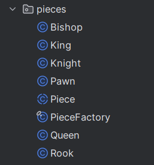

`Board` is also an abstract base class. `StandardChessBoard` extends it and provides the standard chess setup.

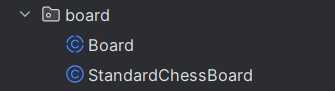

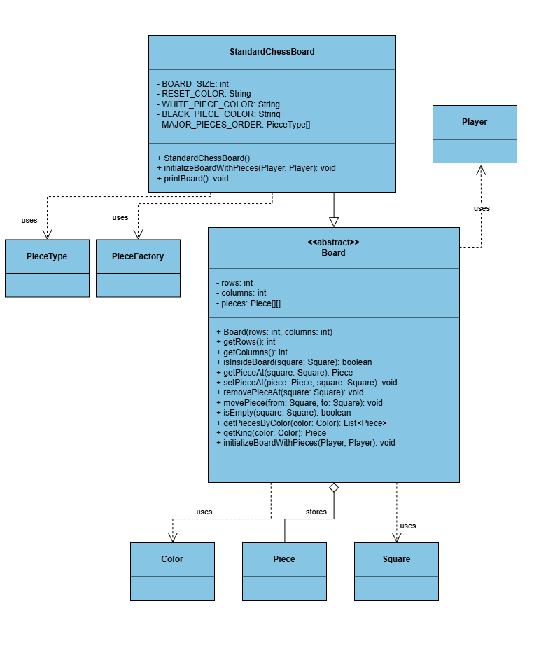

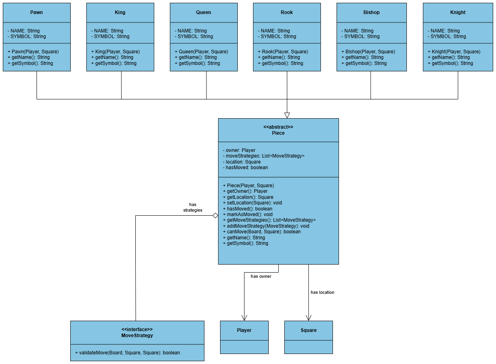

### Composition

Composition is used where one object owns another as part of its internal state. `ChessGame` owns the main runtime objects of the game: the board, parser, validator, executor, players, and current player. `Board` owns the piece matrix, and `Piece` owns its movement strategies.

This is important because a piece does not inherit movement behavior directly. It is composed from strategies, which keeps movement behavior reusable across different pieces.

### Association and dependency

Some classes work together without fully owning each other. `InputValidator` asks the selected piece whether it can move, and it also uses `GameStateChecker` to reject moves that leave the current player's king in check. `MoveExecutor` works with `Board` and `Piece`, but it does not decide whether a move is legal. It only applies a move that already passed validation.

`StandardChessBoard` depends on `PieceFactory` while setting up the initial pieces, and `Promotion` depends on `PieceFactory` because promotion replaces a pawn with a newly created piece.

### Interface-based design

The movement and validation layers are built around interfaces.

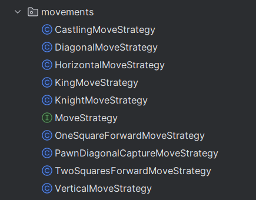

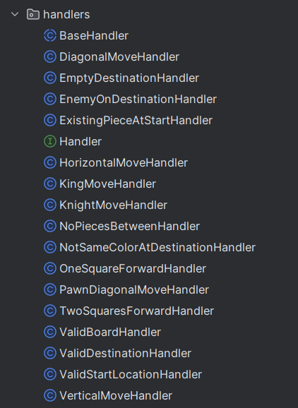

This is what allows the movement layer to be extended without changing every piece or every validator.

## Package Responsibilities

### `components`

This package contains simple objects and enums used across the project. `Square` stores a row and column, but it does not decide whether the square is inside the board. That responsibility belongs to `Board`, because board size is a board-level rule.

`Color`, `GameStatus`, and `PieceType` are enums because their possible values are limited and known.

### `pieces`

`Piece` is the base class for all chess pieces. It stores the owner, current location, movement strategies, and whether the piece has moved before.

Concrete pieces do not duplicate movement logic. Instead, they attach the movement strategies they need.


This is why the queen does not need a large custom movement method. It reuses movement behavior that is also useful for rooks and bishops.

### `board`

`Board` owns the piece matrix and exposes operations such as getting, setting, removing, and moving pieces.

`StandardChessBoard` extends `Board` and sets up the normal chess layout. It uses a major-piece order array instead of hardcoding every starting square manually.

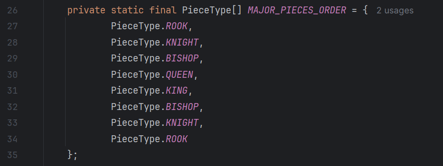

This keeps board initialization readable and avoids unnecessary repeated setup code.

### `movements` and `handlers`

Each class in `movements` represents one movement style. For example, `KnightMoveStrategy` checks knight movement, while `DiagonalMoveStrategy` checks diagonal movement.

The movement strategy does not do all checking directly. It builds a chain of smaller handlers and lets each handler validate one part of the move.

Handlers are small validation classes. Each handler checks one rule, such as whether the destination is inside the board, whether the selected square contains a piece, whether the destination has a friendly/enemy piece, or whether the path is clear.

### `simulators`

This package controls the game flow. `ChessGame` owns the current game objects and runs the console loop. It reads input, asks the parser and validator to process the move, executes valid moves, handles promotion, switches turns, and prints check/checkmate/stalemate messages.

`GameStateChecker` checks check, checkmate, and stalemate. It also simulates possible moves to see whether a player has any legal move left.

### `specialmoves`

Special moves are separated from the normal game loop. `CastlingMoveStrategy` validates whether castling is legal, while `Castling` performs the rook movement after the king move is accepted.

`Promotion` replaces a pawn with the selected promoted piece. The user interaction for choosing the piece stays in `ChessGame`, because reading console input is part of the game flow, not part of the promotion model itself.

## Movement Validation Design

The movement validation starts from the selected piece.

```java
selectedPiece.canMove(board, to)
```

The piece loops through its movement strategies. If any strategy accepts the move, the piece can move to that square.

For example, a queen can move if one of these strategies accepts the move:

```text
HorizontalMoveStrategy
VerticalMoveStrategy
DiagonalMoveStrategy
```

Each strategy builds a chain of validation handlers. A typical horizontal move uses a chain like this:

```text
ValidBoardHandler
→ ValidStartLocationHandler
→ ValidDestinationHandler
→ ExistingPieceAtStartHandler
→ NotSameColorAtDestinationHandler
→ HorizontalMoveHandler
→ NoPiecesBetweenHandler
```

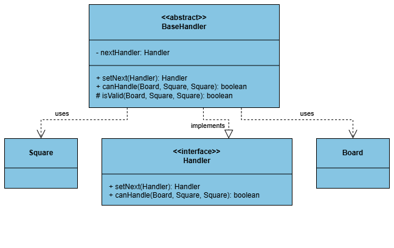

A knight does not use `NoPiecesBetweenHandler`, because knights can jump over pieces. A pawn forward move uses `EmptyDestinationHandler`, while a pawn diagonal capture uses `EnemyOnDestinationHandler`. This keeps pawn forward movement and pawn capture logic separated.

## Strategy Pattern

The movement system uses the Strategy Pattern because different pieces reuse the same movement behavior in different combinations.

```text
Rook   → HorizontalMoveStrategy + VerticalMoveStrategy
Bishop → DiagonalMoveStrategy
Queen  → HorizontalMoveStrategy + VerticalMoveStrategy + DiagonalMoveStrategy
Knight → KnightMoveStrategy
King   → KingMoveStrategy + CastlingMoveStrategy
Pawn   → OneSquareForwardMoveStrategy + TwoSquaresForwardMoveStrategy + PawnDiagonalCaptureMoveStrategy
```

This design makes movement behavior easier to extend. If a new movement type is needed, the project can add a new `MoveStrategy` implementation and attach it to the piece that needs it.

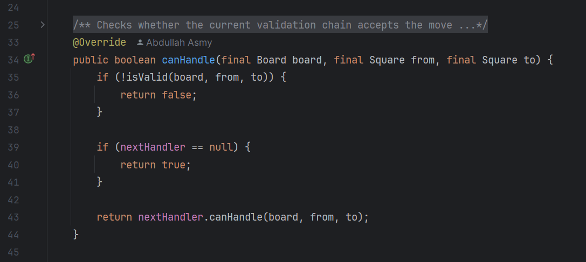

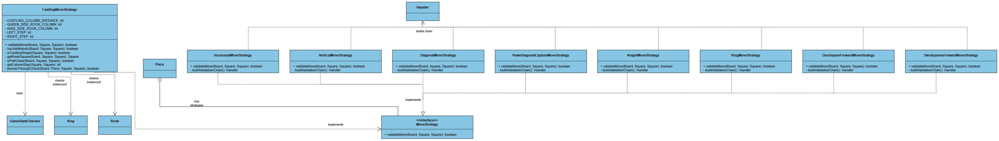

## Chain of Responsibility

The validation process uses a Chain of Responsibility style. The goal is to avoid putting every validation rule inside a single method.

Each handler answers one focused question: is the board valid, is the start square inside the board, is the destination inside the board, is there a piece at the start, is the destination legal, is the movement shape correct, and is the path clear.

If one handler fails, the move is rejected. If it passes, the request moves to the next handler.

This made the movement strategies easier to read and easier to change while the project was growing.

## Piece Creation

The project uses a simple factory-style class called `PieceFactory`.

The factory receives a `PieceType`, owner, and location, then returns the correct concrete piece.

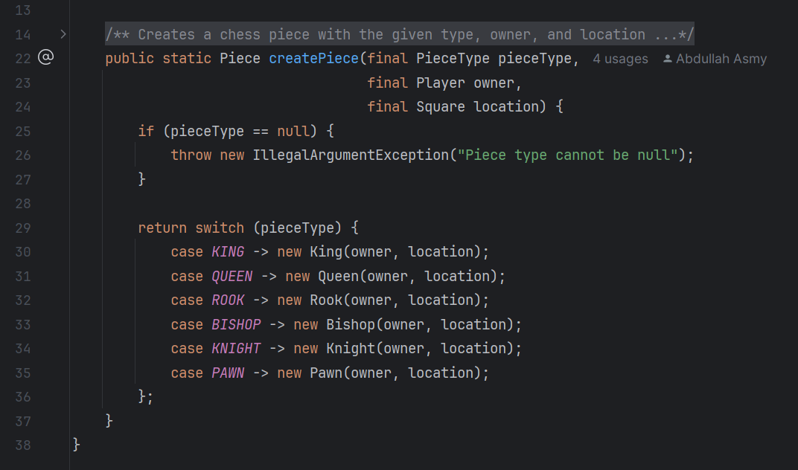

This keeps piece creation centralized. `StandardChessBoard` can initialize pieces without spreading constructor calls everywhere.

This is intentionally not a full classical Factory Method setup with separate factories such as `KingFactory` or `QueenFactory`. That would be heavier than what the project needs right now.

## Game State Checking

`GameStateChecker` handles check, checkmate, and stalemate logic.

For check detection, it finds the king of a given color and checks whether any enemy piece can move to the king's square.

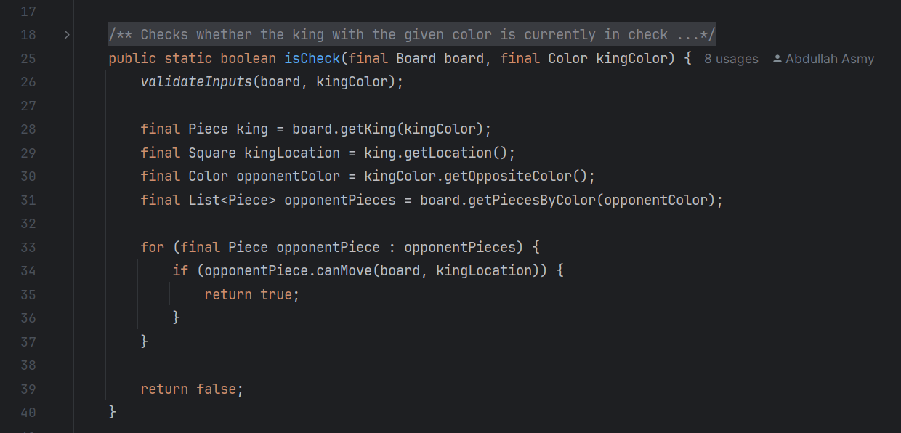

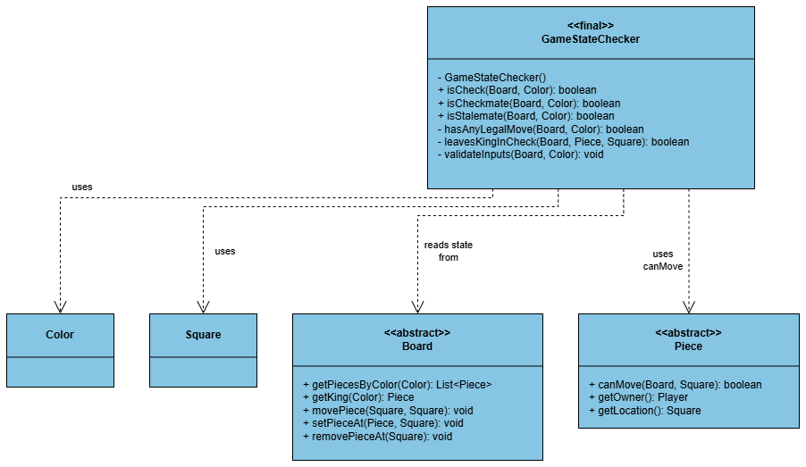

For checkmate and stalemate, the checker searches through the current player's pieces and tries possible target squares. If no legal move can save or continue the game, the state is reported as checkmate or stalemate depending on whether the player is currently in check.

Moves that leave the current player's king in check are blocked by `InputValidator`. It temporarily applies the move, asks `GameStateChecker` whether the king is still in check, then restores the board.

## Game Flow

`ChessGame` is responsible for the console game flow, not for every chess rule. It asks `InputParser` to parse text, `InputValidator` to check whether the move is valid, `MoveExecutor` to apply valid moves, and `GameStateChecker` to report check/checkmate/stalemate after the turn changes.

```text
Main.main()
  → new ChessGame()
     → creates Players, StandardChessBoard, InputParser, InputValidator, MoveExecutor
     → board.initializeBoardWithPieces(whitePlayer, blackPlayer)
  → chessGame.start()
     → loop while isRunning:
        → read input from Scanner
        → check quit / resign commands
        → handleMoveInput(moveText):
           → playMove(moveText):
              → inputParser.parseMove(moveText) → Square[]
              → inputValidator.isValidMove(board, currentPlayer, from, to)
                 → checks piece ownership
                 → checks piece.canMove(board, to)
                 → checks leavesCurrentPlayerInCheck via GameStateChecker.isCheck()
              → if invalid: throw InvalidMoveException
              → moveExecutor.executeMove(board, from, to)
                 → board.movePiece(from, to)
                 → if castling detected: new Castling().execute(board, from, to)
              → handlePromotionIfNeeded(to)
                 → if pawn on promotion row: ask user, then new Promotion().promote()
              → switchTurn()
           → printCheckMessageIfNeeded()
              → GameStateChecker.isCheckmate / isCheck / isStalemate
           → printBoard()
        → catch InvalidMoveException, InvalidInputException, IllegalArgumentException
```

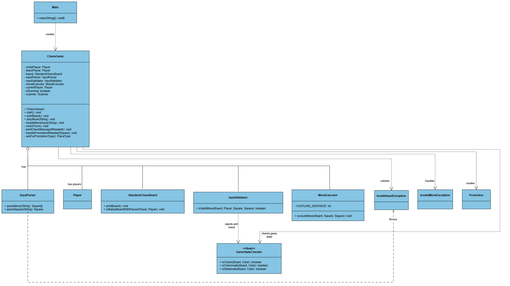

## Special Moves

### Promotion

Promotion is handled after a valid pawn move reaches the final rank.

`ChessGame` asks the player which piece they want:

```text
queen, rook, bishop, or knight
```

Then `Promotion` replaces the pawn with the selected piece using `PieceFactory`.

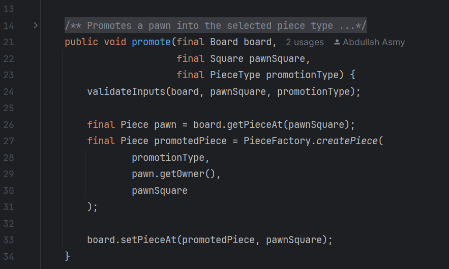

### Castling

Castling has two parts. `CastlingMoveStrategy` validates the move, and `Castling` moves the rook after the king move is executed.

The validation checks that the king and rook have not moved, that the path is clear, that the rook belongs to the same player, that the king is not currently in check, and that the king does not pass through check.

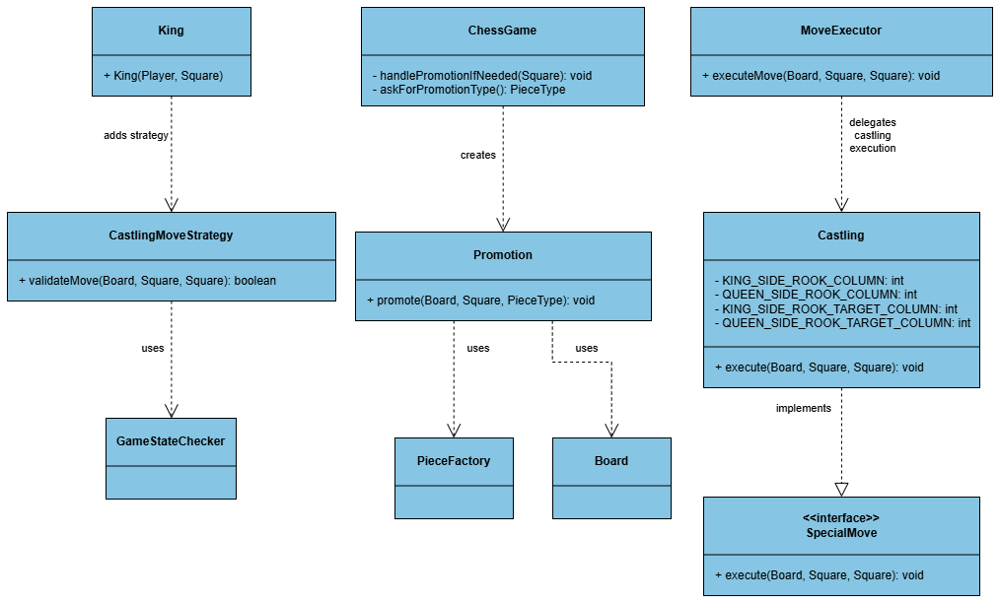

## Custom Exceptions

The project has two custom runtime exceptions.

`InvalidInputException` is used when the text input format is wrong, such as `e9 e4` or a move with only one square.

`InvalidMoveException` is used when the input format is valid, but the move itself is not legal in the current game state.

Internal validation still uses `IllegalArgumentException` or `IllegalStateException` where appropriate. For example, a null board or missing king is not the same kind of problem as a user typing an invalid move.

## Manual Tests

The project currently uses simple manual test classes instead of JUnit. These tests were useful while building the project step by step because they gave quick feedback without adding a full build setup.

Manual tests cover input parsing, input validation, check detection, checkmate detection, promotion, and castling rook movement.

Example manual test output:

```text
Check detection test: true
Checkmate detection test: true
```
## Current Limitations and Future Improvements

The project does not claim to implement every advanced chess rule. The current version focuses on the main engine structure, move validation, game-state checking, promotion, castling, resign flow, custom exceptions, and manual tests.

Some parts can still be improved in future versions:

* Add en passant
* Add full draw-rule support, including threefold repetition, fifty-move rule, and insufficient material
* Add JUnit tests for board, movement strategies, handlers, and game-state checks
* Add Maven or Gradle project setup

There is also a small known limitation in the legal-move search around castling simulations inside `GameStateChecker`. It is acceptable for this stage, but it should be reviewed if the project becomes more complete.
